```
BriefIntroduction: 
这是我和同事 jiuqi 在紫竹第三餐厅吃饭总结出来的经验，时间段大概在 2024-11 开始，到 2025-04 结束（离职）
```

<!-- split -->

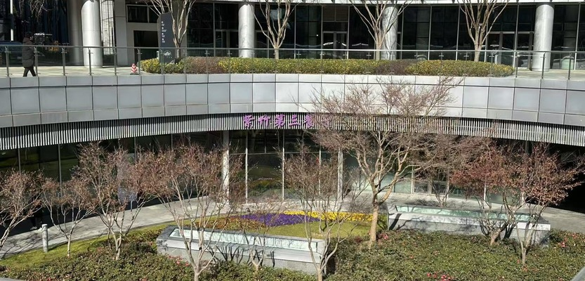

# 紫竹第三餐厅避坑指南

详细地址：上海闵行区紫竹高新区——紫竹第三餐厅

因为作者的第一份工作是在紫竹的 Wicresoft，在职期间作者多次与同事 jiuqi 多次前往该餐厅吃饭，由此总结出的一些经验。这里只放我自己吃过的，没吃过的没写上。

# 面条

购买面条的具体位置比较偏一些，需要仔细找找或者找人问下。面条菜单：

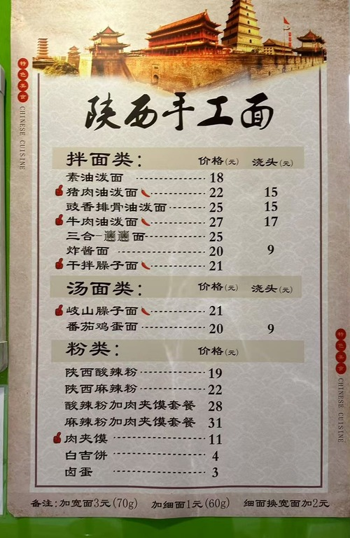

注意小黑板上会有额外的菜单，但是我都没有尝试过

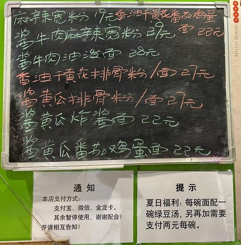

## 推荐

### 猪肉油泼面（宽面）

宽面是由师傅现场用面团拉面的，个人感觉味道更好。而细面则不是现场，而是现成的（感觉更像是在市场上面购买的）

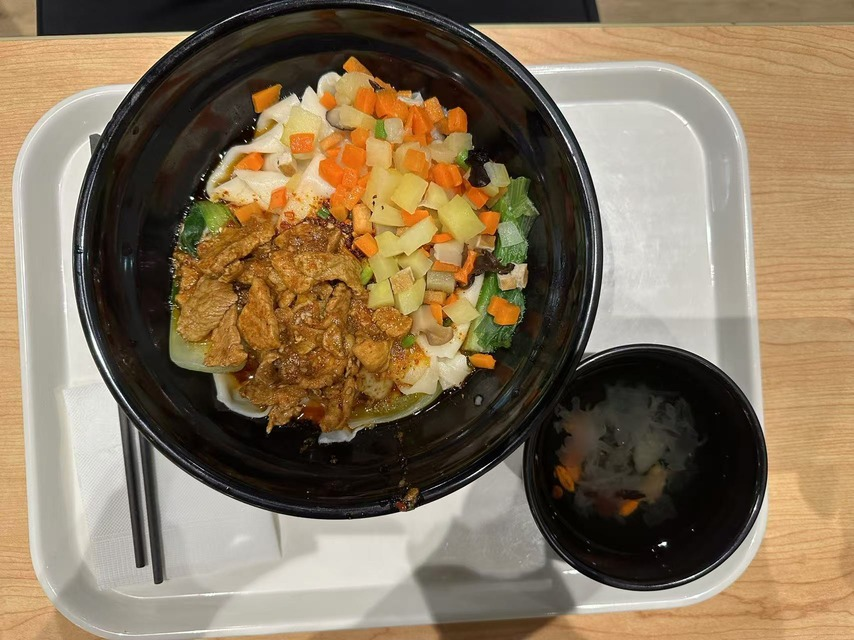

### 牛肉油泼面（宽面）

jiuqi 说味道还可以，但是相比于其价格 27 CNY， 还是猪肉油泼面更具性价比

我尝了一下，牛肉都是纯瘦肉，其实有点柴，如果带一点肥肉会更加的好吃一些，猪肉虽然也都是瘦肉，但是就是会比较软一些。

猪肉油泼 YYDS

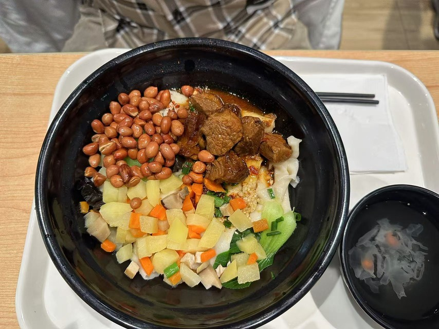

其中的花生米是额外添加的，需要 2 CNY

## 不推荐

臊子面（细面）：包括岐山臊子面和干拌臊子面，jiuqi老师和我吃过之后均不推荐

肉夹馍：jiuqi 老师尝过之后不推荐，肉馅是剁碎的猪肉肘子

# 盖浇饭

菜单：

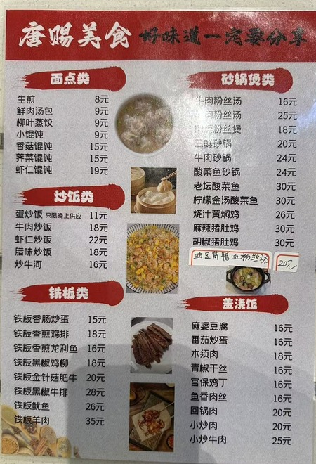

## 推荐

鸡排饭（18 CNY），实惠好吃，但是好吃的部分只有刚煎出来的鸡排

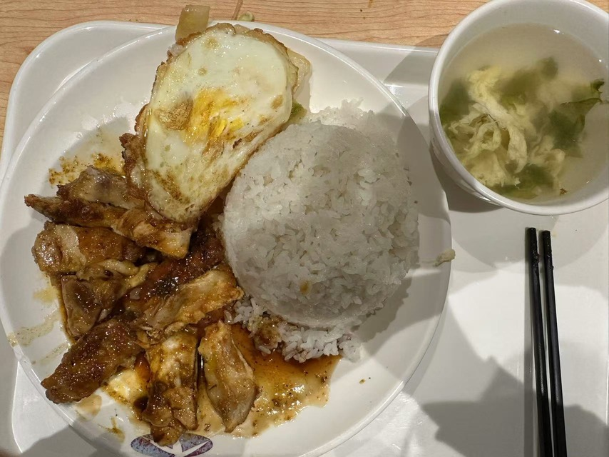

## 一般

猪肚鸡

感觉只有鸡肉味道还可以，其他味道一般，30 CNY 性价比甚至不如牛肉油泼面

干锅鸡翅其实味道也不错，感觉这个餐厅的鸡肉品质都挺好的

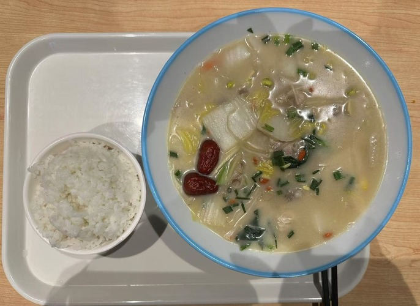


# 烤鱼

菜单

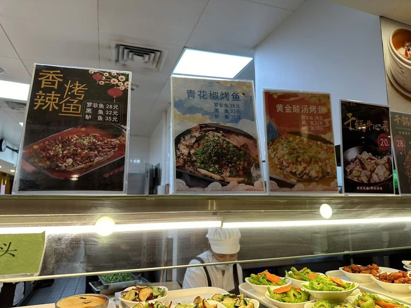

烤鱼分为3种：罗非鱼（28 CNY），黑鱼（32 CNY），鲈鱼（35 CNY）味道都还可以

青花椒烤鲈鱼

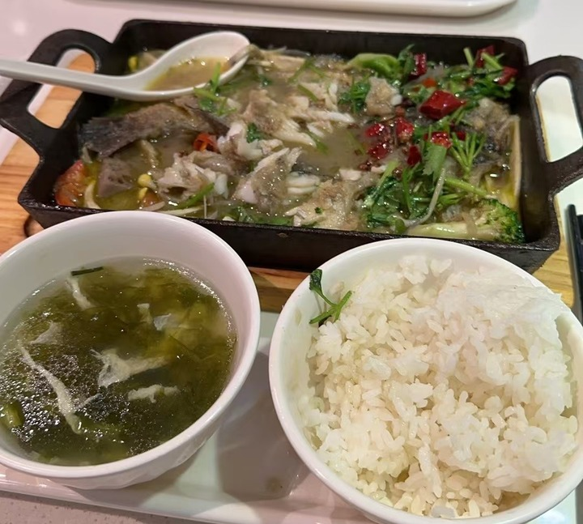

# 干锅

菜单：

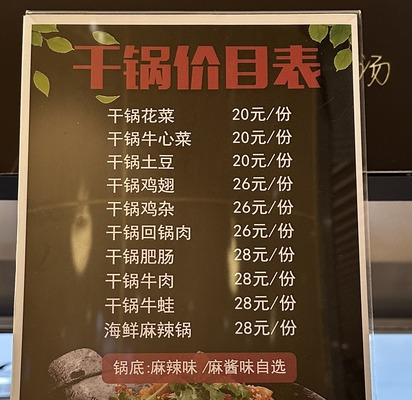

## 牛肉干锅

味道一般，好吃程度取决于配菜，有时候是蒜苔（我不喜欢），有时候是土豆洋葱青红椒，味道还可以的

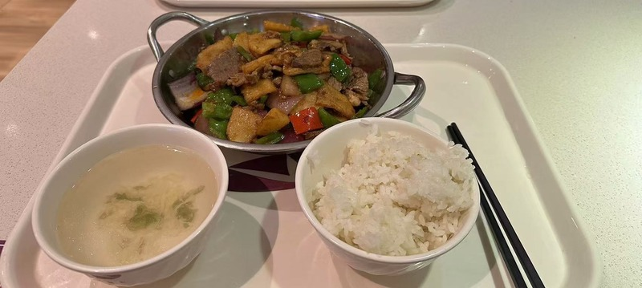

## 鸡翅干锅

味道不错，鸡肉很新鲜，部位大多是鸡翅根，骨头比较多，比较咸

配菜有时候会比较单调，只有青椒，但是味道还是一样的

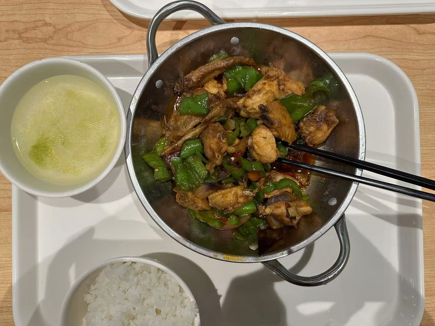

## 干锅牛蛙

感觉味道一般，不推荐，其中大块的牛蛙肉并不入味，相比于28 CNY的价格，还是不太划算的。

好吧其实我发现我自己好像不太喜欢吃牛蛙，目前吃到的感觉都不太喜欢牛蛙肉的口感。

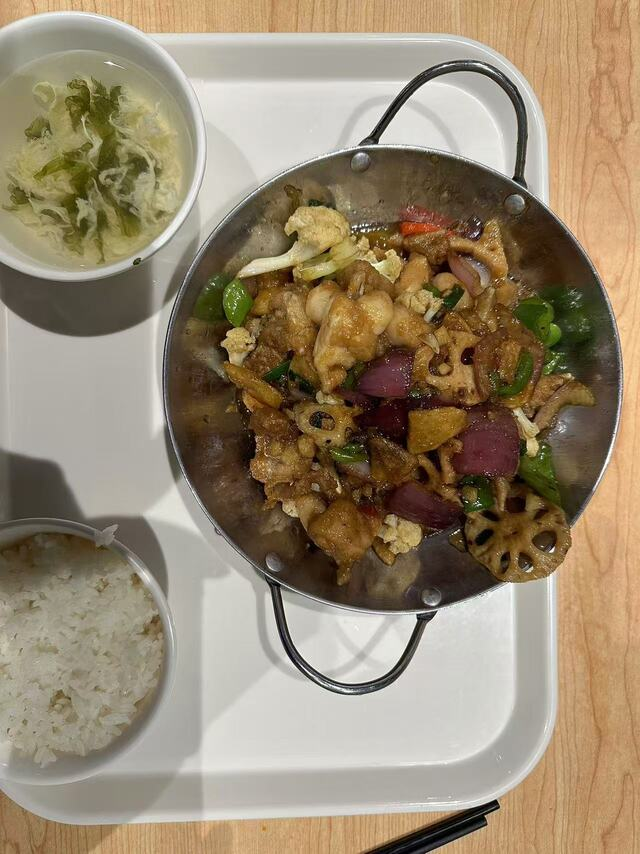

# 砂锅

感觉味道都很一般，似乎都有粉丝？我是不太喜欢粉丝的。

## 羊肉砂锅

羊肉砂锅羊膻味太重，根本无法下嘴，千万不要吃

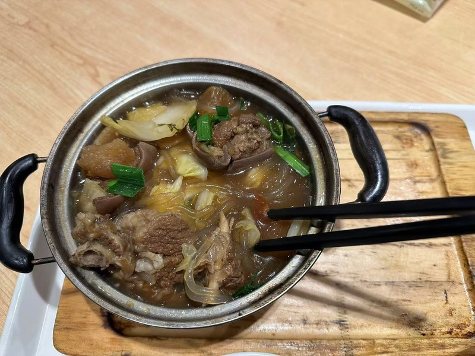

# 快餐窗口

这个我也不知道叫做什么菜，jiuqi老师尝了之后大概是糯米包肉末包咸蛋黄，反正jiuqi老师给出的评价是不太好吃

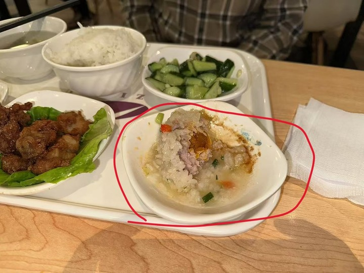

炸小鸡腿，特别好吃，特别的入味，特别的新鲜，绝了

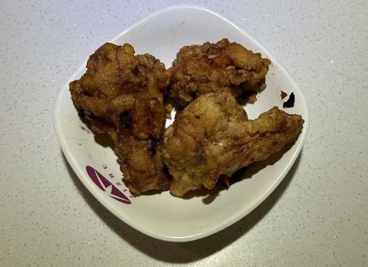

炸芋泥球，好吃

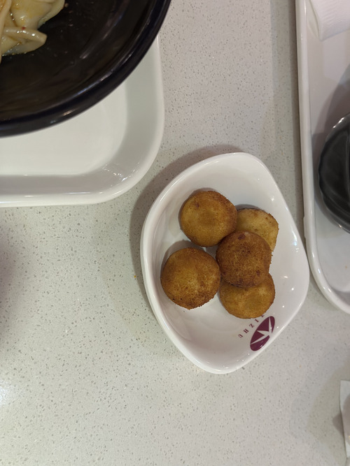

