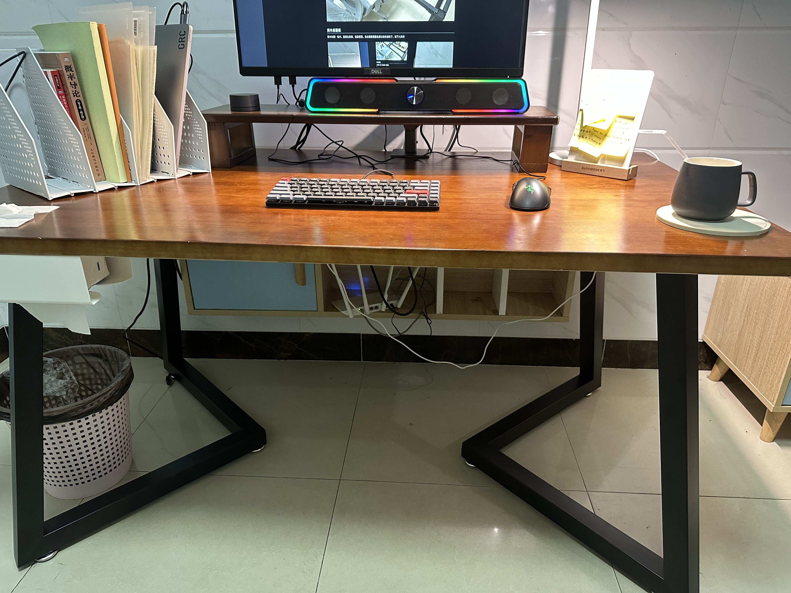

# 电脑桌面定制-2023年

其实之前也定制一次桌面，也是实木桌面和桌腿单独购买，然后拼接在一起，但是没有记录下来，这一次将定制桌面的过程记录下来以供迭代。

预算：500 CNY 以内，同样桌面面板和桌面的铁架分开购买。

策略是：买一把可调节高度的椅子和固定高度的桌子，尽量节省开支

选择电脑桌的2个要素

- 尺寸：140cm $\times$ 80cm $\times$ 3cm
- 材质：实木（松木——便宜但是柔软）

选择的是实木，因为无法确定合成板种甲醛的含量。关于木材，当时买的是松木，因为预算有限。

木材品质和价格可以参考这个：「松木、榆木」-->「白蜡木、白橡木」-->「樱桃木、黑胡桃木」

如果以后有钱了的话可以选择，淘宝店铺：木小北家具（直接一步到位樱桃木和黑胡桃木）

## 桌子腿与稳定性

桌子腿当时购买的高度是65cm，到手后发现太低了，以后定制需要高一点，大概70cm左右，即可。

桌子腿需要好好的规划一下，因为需要防止显示器支架，所以不能桌面四周全部都围起来，这样子显示器支架不能固定，下面的桌子腿虽然非常的稳定，但不不利于其他设备的安装，特别是显示器支架

如下图所示是一个错误的例子

后来我买了其他的桌腿，如下图所示，这样子就可以安装显示器支架了

### 桌面靠墙垫片

当桌子靠近墙面的时候，可以使用一些软的垫片，放在桌子的靠墙面然后再靠墙，可以缓解桌子碰墙的声音

## 实木桌面板

实木材质：松木。虽然比较软，但是便宜。在出租屋里面也是比较合适的了。如下图所示

关于桌面我还有几点想说明

1. 一个是桌面需要一些能够凹陷进去的弧度，这样子可以伸手到达桌面的所有区域。关于这个弧度如何确定，还是一个问题
2. 四个桌角需要打磨的圆滑一些，这样子碰到身体就不会很痛了。
3. 中间需要打孔，来方便显示器走线，最好大一些，可以顺便安装显示器支架

## 桌面布置

1. 置物架

桌面需要一个置物架，如上图所示，这样子可以多放些东西。是单层的还是双层的好呢？对了这个置物架最好做桌面的人一起定制，否则单独购买性价比不高。我整个桌面话费350，置物架话费100元，太不划算了！

2. 显示器支架

显示器需要一个支架，这样子桌面置物架可以多放东西。

增加了显示器支架之后，发现一个问题，我使用了AOC的显示器支架，但是发现比较占地方，这样就无法将置物架对其桌面的边缘。不知道应该如何解决.

还有就是我的超级便宜的条状音箱没有地方放置了，不过等以后有钱了可以购买更好的其他音箱（2个立式）就没有这个问题了

显示器支架没有我想象的这么灵活，可恶！

4. 音箱

关于音箱，确实是没钱买好的，好的都需要500元起步，只能花费100买一个能听的东西。估计以后也是如此吧，暂时没有打算购买好的音箱。可以购买400元价位的漫步者音箱

## 桌面光源选择

如果只有一个显示器，那么选择屏幕挂灯（比如小米），如果有两个显示器，那么屏幕挂灯就不够用了，需要选择一个大的光源。打算选择德普的灯光，作为桌面光源，

## PDU排插

经过测试非常的好用，我买的是8个插座的，感觉可以买的更多插座的，然后功能更加的丰富的

# Reference

1. 定制桌面参考视频[电脑桌选购指南](https://www.bilibili.com/video/BV1W5411S7Lt/?spm_id_from=333.337.search-card.all.click&vd_source=617c4a2b4e326fc6b6269aada0d25986)
