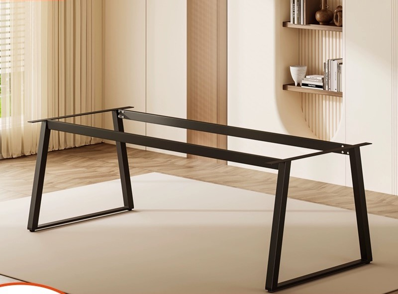
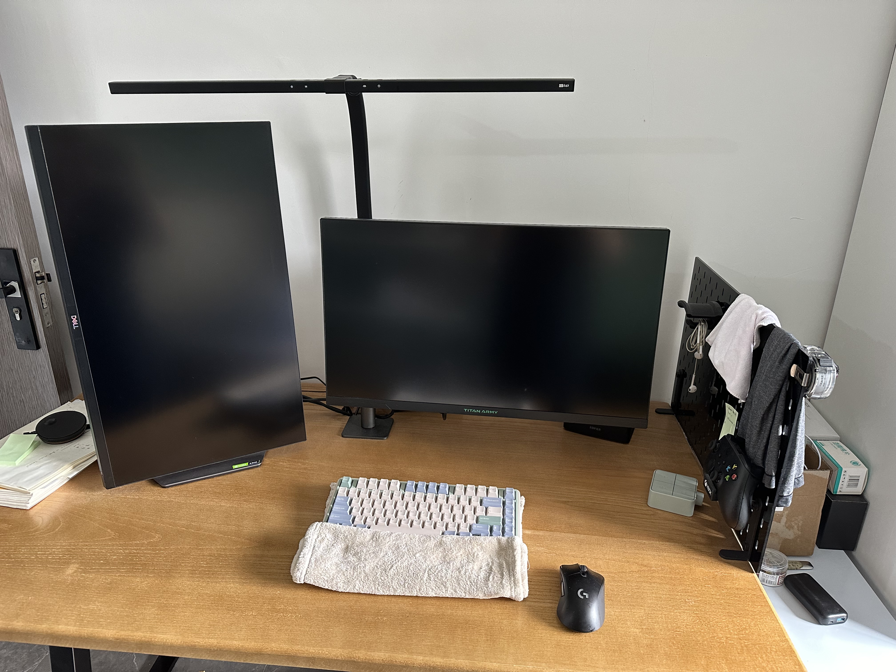
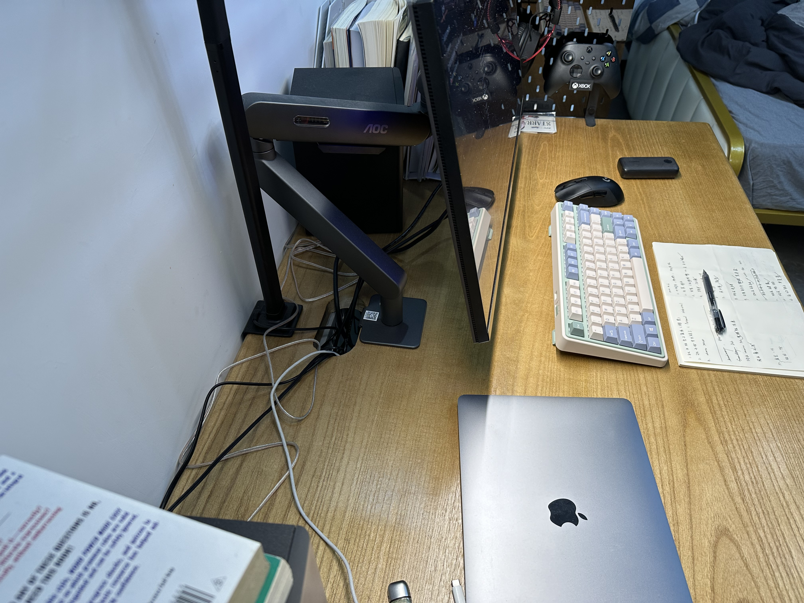
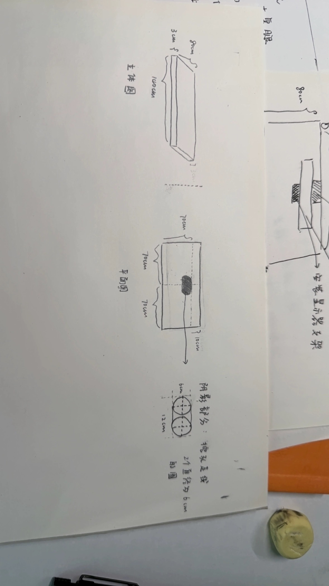
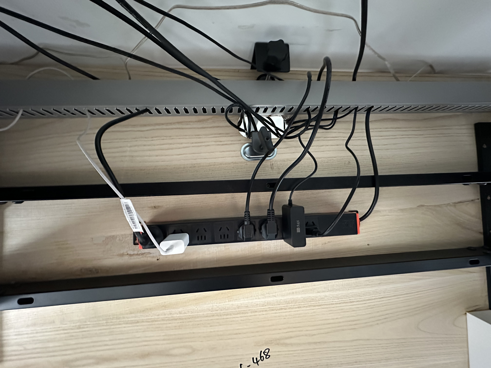

# 电脑桌面定制

时间：2024 - 2026（至今）

在 2023 年末，更换了工作之后，我来到上海（原来那个桌子留在了广东），于是重新定制了一张桌子，继续迭代

预算：这次了一些，1000 CNY 以内。

策略：和之前一样，一把可调节高度的椅子和固定高度的桌子

桌面面板：

- 尺寸：140cm $\times$ 80cm $\times$ 3cm
- 材质：榆木（比松木硬一些，中间挖空不会变形）花费 560 CNY

# 桌腿

这次吸取了上次的教训，直接选择的标准高度：长度 115cm $\times$ 宽度 45cm $\times$ 高度 72.5cm 

花费 276 CNY

如下图，尺寸比桌面小了一号，然后让桌腿中间的横梁靠近桌面后半部分（靠墙的地方）这样子横梁就不会卡到大腿和椅子扶手。

从而可以把椅子的扶手给很贴紧的方式给推入：

# 桌面

材质：榆木。比松木要硬一些，而且松木不支持中间打孔（比较软，容易变形）

其侧面结构为

其设计结构图如下所示

结果发现留下10cm的空隙好像不够显示器支架旋转会卡到台灯。

目前解决方案有

- 加大这个空隙，
- 或者将台灯卡到天花板上

不让其占用后面的空间。

# 桌下理线器

关于桌面下面的理线部分，我参考了 Bilibili 的一个视频[^1]

效果还不错，这样子脚无论怎么踢都不会提到线

# 关于键盘上的毛巾

这个是我用来作为键盘垫子使用的，之前本来打算买一个腕托，但是发现都不喜欢

后来看到这个：

买机械键盘需要配腕托么？键盘腕托能起到保护手腕的作用吗？ - 苗小轩的回答 - 知乎
https://www.zhihu.com/question/25091751/answer/1960670128

用毛巾的话，不仅柔软，还能擦汗，而且高度可以通过折叠的次数来控制，nice

（PS：毛巾我买的是三利的）

# Reference

[^1]: [不到百元的完美桌面理线方案，你不来了解下？_哔哩哔哩_bilibili](https://www.bilibili.com/video/BV1zP4y1T7RS/?spm_id_from=333.999.0.0&vd_source=617c4a2b4e326fc6b6269aada0d25986)
