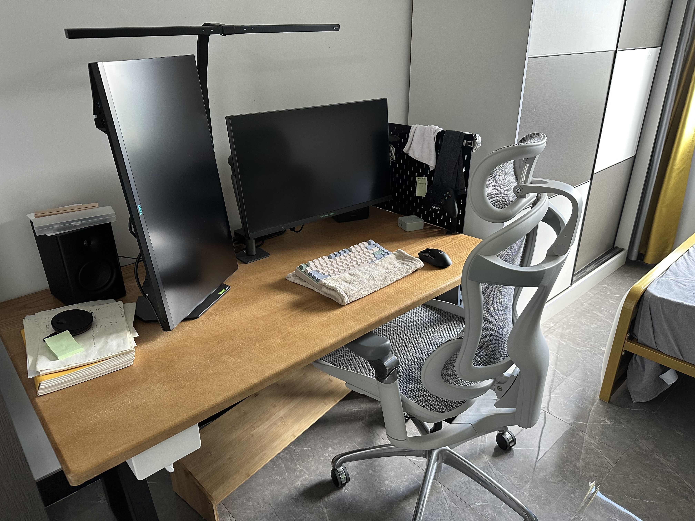
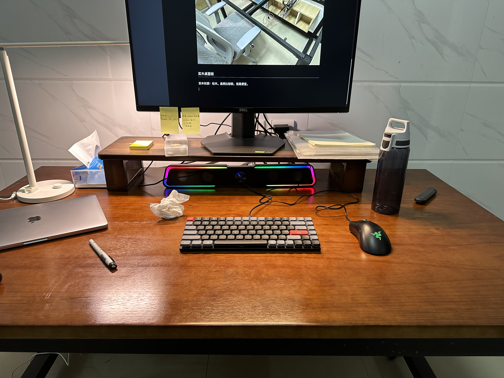
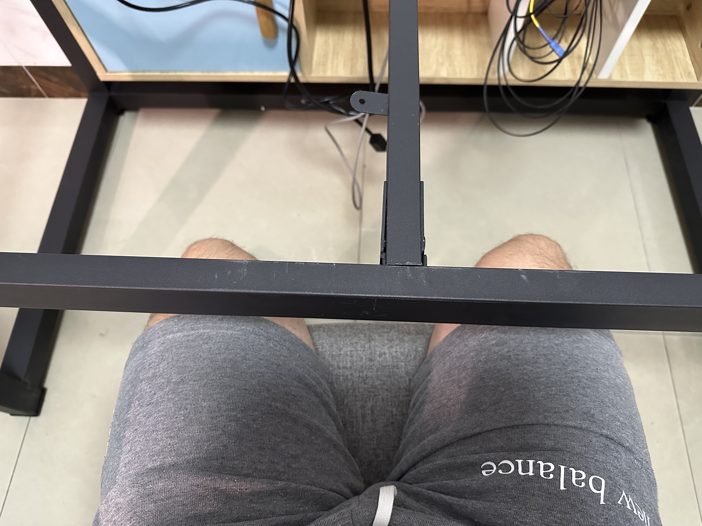
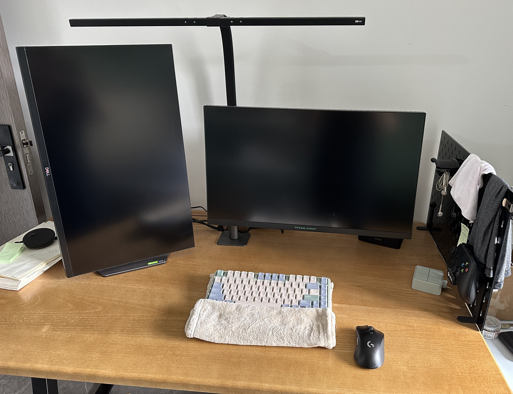
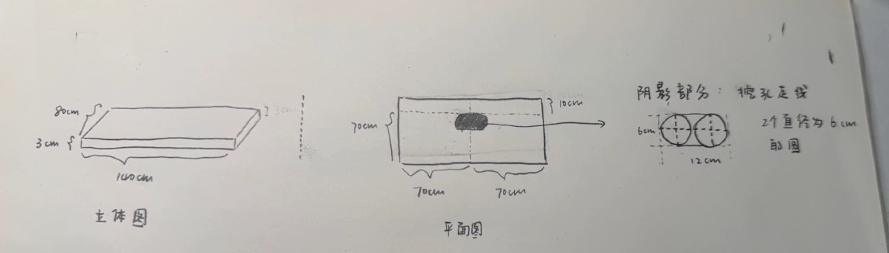
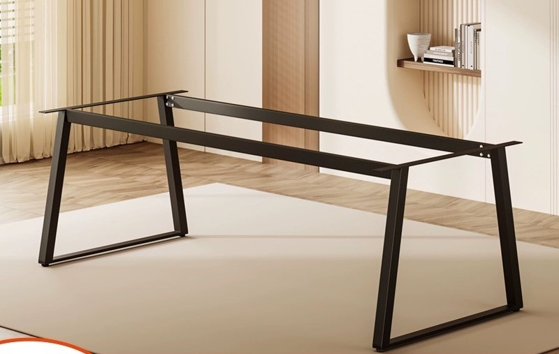
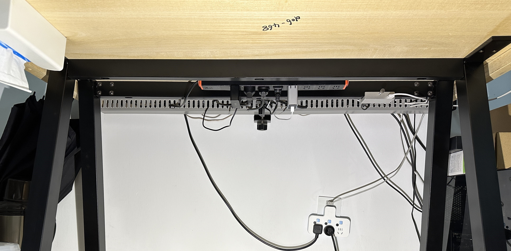
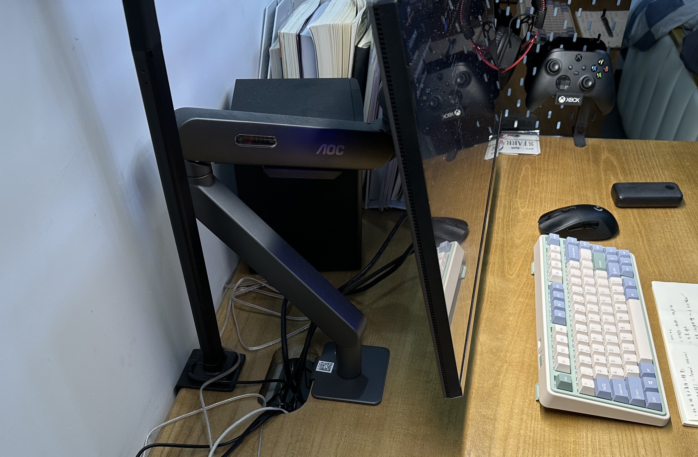

```
BriefIntroduction: 
本人定制工作桌面的经历
```

<!-- split -->



# background

因为工作学习的需求，我希望有一张自己的大桌子，第一次定制桌子的时候，当时是想要站着办公，所以定制了超高的桌腿，结果发现站着半小时就受不了了，算是比较失败的经历。

所以，从 2023 年开始，我把定制桌面的过程记录下来，以供迭代。并且在 bilibili[^电脑桌选购指南] 上面做了一些功课。

选择电脑桌面面板的 2 个要素

- 尺寸：140cm $\times$ 80cm $\times$ 3cm

  > 这个尺寸参考了我大学图书馆提供的自习桌子。当时准备考研（虽然没考上），在那一张自习桌子上坐了挺久了，所以对那个尺寸使用的比较顺手。

- 材质：实木

实木木材品质和价格参考：「松木、榆木」-->「白蜡木、白橡木」-->「樱桃木、黑胡桃木」

如果以后有钱了的话可以选择，淘宝店铺：木小北家具（直接一步到位樱桃木和黑胡桃木）

# version 1: 2023

时间：2023-2024 年

预算：500 CNY 以内，桌面面板和桌腿分开购买

## desk panel

实木材质：松木。比较软（甚至指甲用力划一下就有痕迹），而且店家不支持中间打孔，但是便宜（花费 350 CNY）。如下图



## desk legs

### 桌腿高度

因为我比较矮，当时觉得既然桌子腿定制，那么就买的低一些，于是定制了 65cm，到手后发现太低了，坐在椅子上有点卡大腿。



### 桌腿形状

桌腿最好不要把桌面四周全部都围起来（虽然这样子桌子会很稳定），这不利于其他设备的安装，特别是显示器支架。


后来我买了其他的桌腿，高度 70 cm，花费 148 CNY，如下图，这样子就可以在桌子边缘安装显示器支架了。（虽然稳定比不上之前的那个，只要不用力晃动就挺稳定的，对我来说够用了）


## review

### 桌腿

1. 高度不要太低，直接默认高度（一般是 70cm ~ 75cm 左右）即可

### 桌面

1. 容易磕碰到的桌角和边缘需要打磨的圆滑一些，这样子磕碰到身体就不会痛，靠墙的倒是不必，因为可以和墙面合缝
2. 面板中间最好打孔（大一些），用来安装显示器支架和走线。

### 桌面设备

1. 显示器支架：方便调节横向显示器的位置，并且显示器下方桌面空间可以空出来
2. 桌面光源：如果只有一个显示器，那么选择屏幕挂灯（比如小米），如果有两个显示器，那么屏幕挂灯就不够用了，需要选择一个大的光源。
3. 电源排插：购买了 PDU 排插，8 个插孔，目前勉强够用，感觉还可以再多两个孔位，或者增加 USB / Type-C 供电口。

# version 2: 2024

时间：2024 - 2026（至今）

预算：1000 CNY 以内，桌面和桌腿分开购买

在 2023 年末换了工作之后，我来到上海（原来那个桌子留在了广东），于是重新定制了一张桌子，继续迭代

## desk panel

材质：榆木（比松木硬一些，支持中间打孔）花费 560 CNY



桌面打孔图如下：



## desk legs

吸取了上次高度和形状的教训，这次选择了下图的桌腿（花费 276 CNY），长度 115cm $\times$ 宽度 45cm $\times$ 高度 72.5cm 



这个尺寸比我的桌面小一号，所以可以微调桌腿固定在桌面上的位置。我让桌腿中间的横梁尽量靠近桌面后半部分，也就是靠墙的一侧，这样横梁就不容易卡到大腿和椅子扶手。椅子扶手也可以更贴近桌面并推入桌下，如下图：


## review

### 桌腿

这一次的桌腿吸取了上次的教训，采用标准高度、横梁靠后、椅子扶手能推入桌下，我比较满意。

### 桌面

榆木支持打孔，圆边处理减少磕碰，我也比较满意。

我这里还有一个思考：桌面是否需要内凹弧度？目标是让手能够更容易触达桌面所有区域，关于这个弧度如何确定，还没有考虑好

### 桌面设备

1. 桌下理线

   在 bilibili 上做了功课[^桌面理线方案]，效果还不错，脚很难踢到线

   

2. 键盘腕托

   使用毛巾（品牌：三利）作为键盘腕托，因为可以通过折叠毛巾控制高度，还能擦擦手汗，参考了知乎回答[^毛巾腕托]

3. 桌面光源

   选择的是德普立式屏幕挂灯（1031 CNY），效果很好，可以照亮 1.4 m 长度的整个桌面和 2 个显示器，但是这会卡住我的显示器支架，如下图所示

   

   这还是我已经留了 10cm + 6cm 的长度了，结果还是卡住了。

   为了解决这个问题，我有两个思路：

   - 将台灯上墙，不占用桌面的空间
   - 将这个打孔和桌子尾部的距离加大

   个人更加倾向于第一个，尝试把台灯的灯管直接固定在墙面上。

# next iteration

将预算提高到 1000 - 2000 CNY

# references

[^电脑桌选购指南]: [【建议收藏】电脑桌选购指南 宜家｜淘宝｜实木｜升降桌 哔哩哔哩 bilibili](https://www.bilibili.com/video/BV1W5411S7Lt/?spm_id_from=333.337.search-card.all.click&vd_source=617c4a2b4e326fc6b6269aada0d25986)
[^桌面理线方案]: [不到百元的完美桌面理线方案，你不来了解下？_哔哩哔哩_bilibili](https://www.bilibili.com/video/BV1zP4y1T7RS/?spm_id_from=333.999.0.0&vd_source=617c4a2b4e326fc6b6269aada0d25986)
[^毛巾腕托]: [买机械键盘需要配腕托么？键盘腕托能起到保护手腕的作用吗？ - 苗小轩的回答 - 知乎](https://www.zhihu.com/question/25091751/answer/1960670128)
