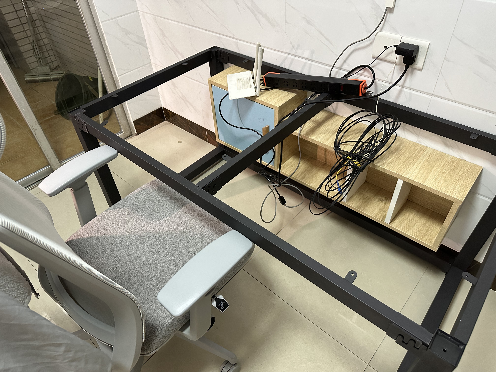

```
BriefIntroduction: 
本人定制工作桌面的经历
```

<!-- split -->

# background

因为工作学习的需求，我希望有一张自己的大桌子，尺寸参考了我大学图书馆提供的自习桌子。当时准备考研（虽然失败了），在那一张自习桌子上坐了挺久了，所以对那个尺寸使用的比较顺手。

第一次定制桌子的时候，当时是想要要站着办公，所以定制了超高的桌腿，结果发现站着半小时就受不了了，算是比较失败的经历。

所以，从 2023 年开始，我把定制桌面的过程记录下来，以供迭代。并且在 bilibili[^电脑桌选购指南] 上面做了一些功课。

选择电脑桌面面板的 2 个要素

- 尺寸：140cm $\times$ 80cm $\times$ 3cm
- 材质：实木

实木木材品质和价格参考：「松木、榆木」-->「白蜡木、白橡木」-->「樱桃木、黑胡桃木」

如果以后有钱了的话可以选择，淘宝店铺：木小北家具（直接一步到位樱桃木和黑胡桃木）

# version 1: 2023

时间：2023-2024 年

预算：500 CNY 以内，桌面面板和桌腿分开购买。

策略：买一把可调节高度的椅子和固定高度的桌子

## desktop panel

实木材质：松木。虽然比较软（甚至指甲用力划一下就有痕迹），但是便宜（花费 350 CNY）。如下图


## desk legs

因为我比较矮，当时觉得既然桌子腿定制，那么就买的低一些，于是定制了 65cm，到手后发现太低了，坐在椅子上有点卡大腿。


还有一点，桌腿最好不要把桌面四周全部都围起来（虽然这样子桌子会很稳定），因为这不利于其他设备的安装，特别是显示器支架。



后来我买了其他的桌腿，高度 70 cm，花费 148 CNY，如下图，这样子就可以在桌子边缘安装显示器支架了。


## problems & lessons

1. 关于桌腿高度：不要太低，直接默认高度（一般是 70cm ~ 75cm 左右）即可
2. 桌面面板：面向人的桌角要打磨的圆滑一些，这样子磕碰到身体就不会痛，靠墙的倒是不必，因为可以和墙面合缝
3. 桌面面板：中间最好打孔（大一些），用来安装显示器支架和走线。

关于桌面我还有几点想说明

1. 一个是桌面需要一些能够凹陷进去的弧度，这样子可以伸手到达桌面的所有区域。关于这个弧度如何确定，还是一个问题
2. 显示器支架：方便调节横向显示器的位置，并且显示器下方桌面空间可以空出来
3. 桌面光源：如果只有一个显示器，那么选择屏幕挂灯（比如小米），如果有两个显示器，那么屏幕挂灯就不够用了，需要选择一个大的光源。
4. 桌面排插：选择的是 PDU 排插，8个插孔，目前勉强够用，感觉还可以在多2个孔位的，或者有 USB, TYPE C 供电的。

# version 2: 2024

## desktop


## desk legs


## problems


## desk


# next iteration

选择白橡木，预算高一些

# references

[^电脑桌选购指南]: [【建议收藏】电脑桌选购指南 宜家｜淘宝｜实木｜升降桌 哔哩哔哩 bilibili](https://www.bilibili.com/video/BV1W5411S7Lt/?spm_id_from=333.337.search-card.all.click&vd_source=617c4a2b4e326fc6b6269aada0d25986)